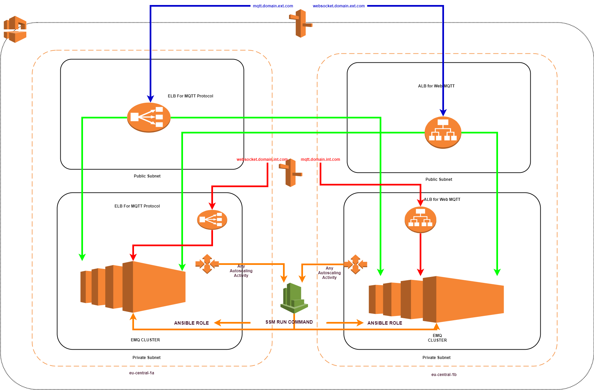
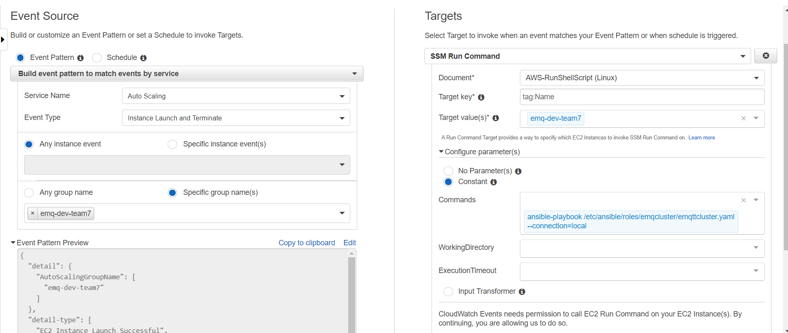

# EMQ

### EMQ Cluster Installation Using Terraform and Ansible on AWS Autoscaling Group

I have used below technology on this  EMQ Cluster Automation

* Terraform
* AWS EC2
* AWS Autoscalingroup
* AWS Cloudwatch
* Python Boto3
* Ansible 
 

This code include ansible role and terraform automate deployment emq cluster on aws with autoscaling group and emq autocluster.

####The AWS Dizayn Architecture as below

##### AWS Infrastructure: 

Deployment using terraform getting some AWS resources information from reference architecture which have already created and then deploy infrastructure based on this Reference(Reference provide **VPC**,**Private,Public Subnet**,**Security Group** **and some extras**.)

It is possible deploy multiple different account supporting on AWS using tfvars file and deployment fully parameterized and automated.

Firstly during deployment create AWS infrastructure using terraform  then all instance in ASG launched with Cloud Config YAML that is include some requirement variable setting some package installation and then run ansible role

During deployment Ansible role control and install EMQ , configuration of EMQ specific and autocluster join operation by custom solution.Then ASG and instance creating and EMQ Cluster join operation completed Cluster ready to using behind load balancer.

EMQ Cluster method choose static method this method is consist of emq.conf file which include static seed instance hostname or ip adress for autocluster.If you want to learn about detail you can look at EMQ documentation

[EMQ Cluster Reference link](http://emqtt.io/docs/v2/cluster.html)

###### Autocluster by static node list

`cluster.discovery = static`
 
 ##--------------------------------------------------------------------
 ## Cluster with static node list
 
 `cluster.static.seeds = emq1@127.0.0.1,ekka2@127.0.0.1`

There is a CloudWatch Rule defined any ASG activity occured such instance termination or instance launch run SSM Command which is a one line shell command to run ansible playbook recent instances.Because I have used static method `cluster.static.seed` in EMQ autocluster so the emq configuration file has to updated each time when any ASG activity occured.
So new instance already will ben used ansible to emq installation and autocluster configuration in cloud config yaml on first launch time.Then Cloudwatch event trigger SSM run command which is execute ansible-playbook command to run that  role which only running current nodes because new instances already run role via cloud-init config and then update emq.conf file base static seed

CloudWatch Rule Definition: 

Just You can change tfvars file as your requirement

